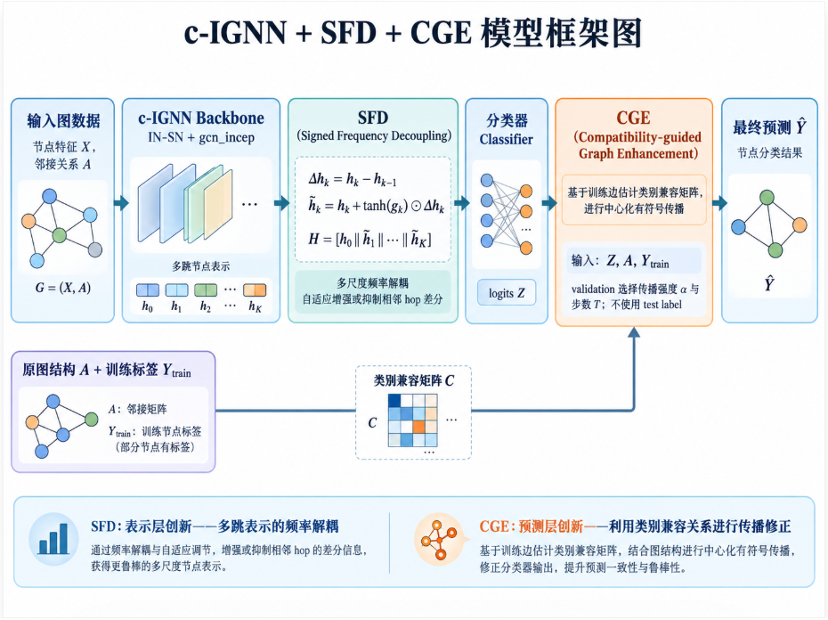

# 方法演变：从 IGNN concat 到 RS-DCFT

本文档只记录影响最终方法的主线。实验过程中出现但被明确淘汰的 Attention 堆叠、Correct-and-Smooth、masked-label、edge-conditioned 等候选没有进入发布模型，避免把失败分支混入最终叙述。

## 0. 原始 c-IGNN：完整 hop 拼接

对一个 `K` hop 模型，IGNN 产生 `h0, h1, ..., hK`。原始 NR 将所有 hop 完整拼接再输入 MLP：

```text
H = [h0 || h1 || ... || hK]
out = MLPconcat(H)
```

它不会在进入 MLP 前把 hop 压缩成单个向量，但没有显式描述相邻 hop 的频率变化和类别兼容关系。

## 1. SFD：相邻 hop 的带符号频率解耦

SFD 保留完整 concat 主体，只在拼接前计算相邻 hop 差分：

```text
Δhk = hk - h(k-1)
gk  = tanh(θk)
h̃k = hk + gk ⊙ Δhk
H   = [h0 || h̃1 || ... || h̃K]
```

`gk ∈ [-1,1]^d` 为逐 hop、逐通道参数。正值增强差分方向，负值抑制或反转差分，零初始化保证训练开始时严格退化到原始 IGNN 表示。

代码：[SpectralFeatureDecoupling.py](../ignn/modules/SpectralFeatureDecoupling.py)

历史阶段框架图如下。图中的 CGE 是早期兼容传播概念，最终实现已替换为第 4、5 节的双尺度兼容头和可靠性选择器。



## 2. 全局兼容微调：CMFT

从训练标签和 backbone 预测估计类别兼容矩阵 `C`：`C[a,b]` 表示中心类别 `a` 与邻居类别 `b` 的兼容强度。训练节点使用真实 one-hot 标签，其他节点使用 backbone 概率，形成 `Pseed`：

```text
E = normalize(A Pseed C^T)
Zglobal = Z + s · center(log E)
```

`s` 是有界可学习强度；`C` 使用 CMGNN 估计作为先验，并通过 row-softmax 保持逐行归一化。这一阶段宏平均配对 test 增益为 **+0.270 pp**。它稳定、参数少，但所有节点共享同一传播形式。

代码：[CompatibilityGuidedFineTuning.py](../ignn/modules/CompatibilityGuidedFineTuning.py)

## 3. 节点关系残差

为每个节点构造：

```text
B = center(log softmax(Z))
Q = center(log E)
r = [B || Q || |B-Q| || B⊙Q]
ΔZnode = MLPrelation(r)
Zrelation = Z + ΔZnode
```

最后一层零初始化，因此初始输出等于 backbone。该版本在 Squirrel 上 10/10 split 全部提升，但 Chameleon 明显过拟合，八数据集宏平均只有 **+0.210 pp**。节点级关系有价值，但不能独立承担全部兼容修正。

代码：[CompatibilityRelationAdapter.py](../ignn/modules/CompatibilityRelationAdapter.py)

## 4. 双尺度兼容头

双尺度头把两种互补偏置放在同一个模块中：

```text
Zglobal = Z + s · center(log E)
ΔZnode  = MLPrelation([B || Q || |B-Q| || B⊙Q])
Zdual   = Zglobal + sigmoid(γ) · ΔZnode
```

- 全局头负责低方差类别传播；
- relation MLP 只拟合全局路径未解释的节点残差；
- `sigmoid(γ)` 限制节点分支的整体容量；
- relation 输出层零初始化；
- 全局分支和节点分支共享同一兼容矩阵语义。

固定 `hidden=8`、联合微调分类器的配置在 80 个 split 上达到 **+0.4996 pp** 宏平均配对增益。

代码：[DualScaleCompatibilityAdapter.py](../ignn/modules/DualScaleCompatibilityAdapter.py)

## 5. RS-DCFT：validation-only 可靠性选择

最终模型同时训练全局兼容头和双尺度兼容头，并使用同一条规则：

```text
if validation_accuracy(dual) >= validation_accuracy(global):
    selected = dual
else:
    selected = global
```

该规则不接收数据集名称，不包含数据集专属阈值，也不读取 test 标签。选择结果作为 buffer 写入 state dict，可在 test 和部署阶段精确恢复。

最终宏平均配对 test 增益为 **+0.5298 pp**。八个数据集中七个平均为正；Chameleon 为 `-0.225 pp`，因此结论限定为“跨八个基准的平均提升”。

代码：[CompatibilityReliabilitySelector.py](../ignn/modules/CompatibilityReliabilitySelector.py)

## 6. 实验控制

- 每个数据集使用 10 个相同固定 split；
- train/validation/test 比例为 48%/32%/20%；
- 两个兼容头从同一个 SFD checkpoint 开始；
- checkpoint 与输出头仅由 validation accuracy 决定；
- test 标签不参与训练、checkpoint 或输出头选择；
- 兼容头结构和候选集合跨数据集一致；
- 不根据数据集名称切换兼容公式或阈值。

逐 split 的 split hash、validation accuracy、选择头和 test accuracy 均保存在 [最终 JSON](../experiments/reliability_selected_compatibility_10splits.json) 中。

## 7. 结论边界

可以陈述：

> 在固定 SFD backbone 和统一的 validation-only 可靠性规则下，RS-DCFT 在八个图节点分类基准、每个十个固定划分上取得 +0.5298 个百分点的宏平均配对 test 增益，七个数据集的平均结果为正。

不应陈述所有数据集均提升。主要增益来自 Squirrel，其他数据集多数为弱正增益。
